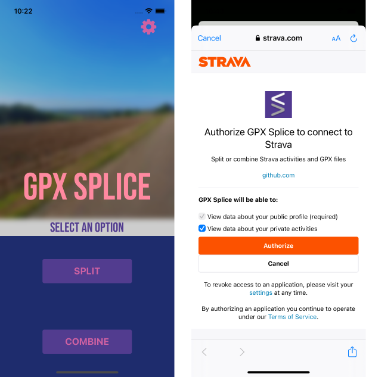
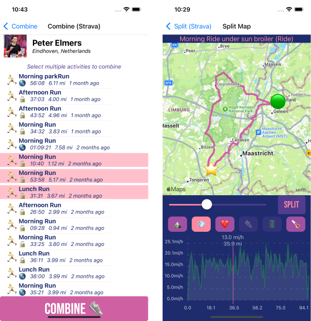

<div align="center">
 


<a href="https://apps.apple.com/app/gpxsplice/id6475313748"></a>
<a href="https://play.google.com/store/apps/details?id=com.pelmers.gpxsplice"></a>

# [GPX Splice](https://pelmers.com/announcing-gpx-splice/)

</div>

### The _easy_ way to split and combine your GPX files and Strava activities, from your phone!

## Features

- Support GPX files and Strava activities
- Split GPX files into multiple files
- Combine multiple GPX files into one
- Full mapping visualization and interactive stats charts (elevation, speed, heart rate, etc.)
- Settings for metric and imperial units
- All processing stays on your phone
- Direct upload of results to Strava

## Examples



_above:_ **Title screen and Strava authentication**



_above:_ **Activity list and split map view**

## Development

This app is written in React Native using the [Expo](https://expo.io/) framework.

See **[my blog post](https://pelmers.com/tour-of-react-native-2024/)** for a full technical writeup.

- `yarn ios` to run in the iOS simulator
- `yarn android` to run in the Android emulator

> To show maps on Android, you need a Google Maps API key.
> Create a file named `.env.local` with the line `GOOGLE_MAPS_API_KEY=your_key_here`.

**Code**:
Look at [src/App.tsx](src/App.tsx) for the main app entrypoint.
All screens are contained in [src/screens](src/screens), and other UI components are in [src/components](src/components).

_Note:_
If you want to develop the Strava integration, you will need to register an app on Strava settings and deploy `gpxsplice_redirect_server.py` somewhere.
However you most likely don't need to touch this if you're just trying to make a fix or new feature.

## Production Builds

```
eas build -p ios --profile production [--local]
eas build -p android --profile production [--local]
```

## Future work

- Support for web platform so you can use it as a website
- Allow upload to Strava even if you did not log in with Strava to fetch activities
- Multiple split points (though you can do this today by doing split multiple times)
- Light and dark mode color themes
- Look for other TODO in the codebase
